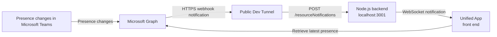
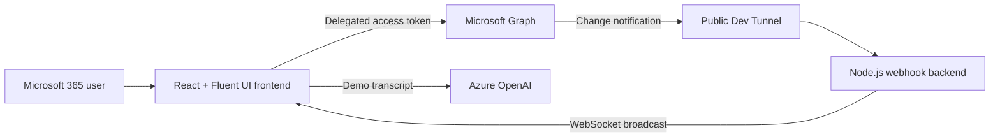

# Unified App

Unified App is a React and Node.js sample that brings Microsoft 365 presence, calendar, Outlook, Teams files, Entra ID, and diagnostic activity into one connected experience.

It includes a notification backend, Microsoft Graph presence subscriptions, WebSocket updates, Teams file controls, and an Azure OpenAI meeting-summary demo.

## Complete Setup and Run

The integrated presence experience uses three running processes:

1. Node.js backend on port `3001`
2. Public Dev Tunnel forwarding to port `3001`
3. React frontend on port `3000`

### 1. Prerequisites

Install or obtain:

- [Node.js](https://nodejs.org/) 18 or later
- [Yarn Classic](https://classic.yarnpkg.com/) 1.x for the frontend
- npm for the backend
- [Microsoft Dev Tunnels CLI](https://learn.microsoft.com/azure/developer/dev-tunnels/get-started)
- A Microsoft 365 work or school account
- Access to create a Microsoft Entra app registration
- Optional: an Azure OpenAI resource and deployed chat model for the meeting-summary demo

This project has been tested with Node.js `22.17.1`, npm `11.6.0`, Yarn `1.22.22`, and Dev Tunnels CLI `1.0.2030`.

### 2. Register the frontend application in Microsoft Entra ID

> **Multitenant registration is required.** Unified App authenticates through the Microsoft identity platform's `/common` authority. Authentication will fail, commonly with `AADSTS50194`, if the app registration is configured as single-tenant.

1. Open the [Microsoft Entra admin center](https://entra.microsoft.com/).
2. Go to **Identity > Applications > App registrations**.
3. Select **New registration**.
4. Enter a name such as `Unified App`.
5. Under **Supported account types**, select **Accounts in any organizational directory (Any Microsoft Entra ID tenant - Multitenant)**. Do not select a single-tenant option.
6. Add a **Single-page application (SPA)** redirect URI:

   ```text
   http://localhost:3000
   ```

7. Register the application and copy its **Application (client) ID**.
8. Under **API permissions**, add the Microsoft Graph delegated permissions needed by the enabled scenarios.
9. Grant tenant-wide admin consent where your organization requires it.

The current sample requests the following delegated permissions:

| Scenario | Microsoft Graph delegated permissions |
| --- | --- |
| Identity | `User.Read`, `User.ReadBasic.All`, `User.ReadWrite.All` |
| Presence | `Presence.Read.All`, `Presence.ReadWrite` |
| Calendar and transcripts | `Calendars.ReadWrite`, `OnlineMeetingTranscript.Read.All` |
| Teams and files | `Team.ReadBasic.All`, `Channel.ReadBasic.All`, `Group.Read.All`, `Group.ReadWrite.All`, `Files.Read`, `Files.Read.All`, `Files.ReadWrite.All`, `Sites.Read.All`, `Sites.ReadWrite.All` |
| Outlook and people | `Mail.Read`, `Mail.ReadBasic`, `Mail.ReadWrite`, `People.Read`, `People.Read.All` |
| Entra ID | `Directory.ReadWrite.All`, `Directory.AccessAsUser.All` |
| Additional sample capabilities | `Bookmark.Read.All`, `ExternalItem.Read.All`, `Tasks.Read`, `Tasks.ReadWrite` |

> This is a demonstration application with broad permissions. For a production application, request only the least-privileged permissions required by the features you enable.

### 3. Configure the frontend

From the repository root:

```powershell
cd .\frontend
Copy-Item env.sample .env
```

Open `frontend/.env` and configure these values:

| Variable | Required | Description |
| --- | --- | --- |
| `REACT_APP_CLIENT_ID` | Yes | Application client ID from the Entra registration |
| `REACT_APP_SITE_NAME` | Yes | Product name displayed in the header and browser title |
| `REACT_APP_DOMAIN` | For live presence | Dev Tunnel hostname only, without `https://`, `wss://`, a path, or trailing slash |
| `REACT_APP_ENABLE_CALENDAR` | No | Set to `true` to show Calendar after sign-in |
| `REACT_APP_ENABLE_OUTLOOK` | No | Set to `true` to show Outlook after sign-in |
| `REACT_APP_ENABLE_TEAMS` | No | Set to `true` to show Teams files after sign-in |
| `REACT_APP_ENABLE_ENTRAID` | No | Set to `true` to show Entra ID when the user has permission |
| `REACT_APP_OPENAI_RES_NAME` | For AI summary | Azure OpenAI resource name |
| `REACT_APP_OPENAI_DEPLOY_ID` | For AI summary | Azure OpenAI model deployment name |
| `REACT_APP_OPENAI_API_VERSION` | For AI summary | Azure OpenAI API version; sample default is `2024-10-21` |
| `REACT_APP_OPENAI_API_KEY` | For AI summary | Azure OpenAI key used by this client-side demo |

Do not commit `.env`. It is ignored by Git. Variables beginning with `REACT_APP_` are embedded in the browser bundle, so the Azure OpenAI key configuration is suitable only for this demo. Use a backend or keyless authentication for production.

### 4. Configure the backend

Create the backend environment file:

```powershell
cd ..\backend
Copy-Item env.sample .env
```

Configure:

| Variable | Required | Description |
| --- | --- | --- |
| `CLIENT_ID` | For `/getAppToken` | Client ID of an Entra confidential-client application |
| `CLIENT_SECRET` | For `/getAppToken` | Client secret for that application |
| `TENANT_ID` | For `/getAppToken` | Microsoft Entra tenant ID |
| `SCOPE` | No | Defaults to `https://graph.microsoft.com/.default` |
| `PORT` | No | Backend port; defaults to `3001` |

The webhook-to-WebSocket notification relay does not require Redis. The confidential-client values are used by the optional `/getAppToken` endpoint.

Never put `CLIENT_SECRET` in the frontend or commit `backend/.env`.

#### Why the backend is required

Microsoft Graph sends change notifications to a publicly reachable HTTPS webhook. A browser running on `localhost` cannot receive that server-to-server webhook directly. The Node.js backend receives and validates the notification, then relays it to Unified App over WebSocket.



The Dev Tunnel provides public HTTPS ingress during local development. The backend handles Graph's webhook validation request and notification payload, while the Unified App front end retrieves and displays the latest presence using the signed-in user's delegated access token.

### 5. Install dependencies

Install the frontend dependencies with the committed Yarn lockfile:

```powershell
cd ..\frontend
yarn install --frozen-lockfile
```

Install the backend dependencies with the committed npm lockfile:

```powershell
cd ..\backend
npm ci
```

### 6. Create a public Dev Tunnel

Microsoft Graph must be able to reach the webhook over public HTTPS. Create an anonymous tunnel that forwards to the local backend on port `3001`.

If `devtunnel` is on `PATH`:

```powershell
devtunnel user login --entra --use-integrated-windows-auth
devtunnel create unifiedapp-demo --allow-anonymous
```

Copy the tunnel ID returned by the create command, including any region suffix, and use it below:

```powershell
$tunnelId = "<returned-tunnel-id>"
devtunnel port create $tunnelId -p 3001 --protocol http
devtunnel host $tunnelId
```

On Windows, if the command is not on `PATH`, the standalone executable may be available here:

```powershell
$devtunnel = "$env:LOCALAPPDATA\Programs\DevTunnel\devtunnel.exe"
& $devtunnel user login --entra --use-integrated-windows-auth
& $devtunnel create unifiedapp-demo --allow-anonymous
$tunnelId = "<returned-tunnel-id>"
& $devtunnel port create $tunnelId -p 3001 --protocol http
& $devtunnel host $tunnelId
```

The host command prints a public URL similar to:

```text
https://<hostname>.devtunnels.ms
```

Set only the hostname in `frontend/.env`:

```dotenv
REACT_APP_DOMAIN="<hostname>.devtunnels.ms"
```

Keep the tunnel host process running. Restart the frontend after changing `frontend/.env`.

### 7. Start the integrated application

Open three terminals from the repository root.

**Terminal 1: backend**

```powershell
cd .\backend
npm start
```

Expected output:

```text
Server is running on port 3001
```

**Terminal 2: Dev Tunnel**

```powershell
$tunnelId = "<returned-tunnel-id>"
devtunnel host $tunnelId
```

Use the full executable path shown earlier when `devtunnel` is not on `PATH`.

**Terminal 3: frontend**

```powershell
cd .\frontend
yarn start
```

Open [http://localhost:3000](http://localhost:3000), select **Sign In**, and authenticate with a Microsoft 365 account from a tenant where the requested permissions have been consented.

### 8. Verify the setup

1. Confirm the browser title and header display **Unified App**.
2. Sign in and verify the enabled Calendar, Outlook, Teams, and Entra ID navigation items appear.
3. Open Calendar and verify meetings load.
4. Open Teams, select a team and channel, and verify its files load.
5. Change your presence in Microsoft Teams and confirm Unified App updates without a page refresh.
6. Check the backend output for a WebSocket client and Graph notification activity.
7. In **Settings**, enable **Show logging flyout** to inspect activity generated by each interaction.

The real-time presence path is healthy when the backend displays messages similar to:

```text
Client connected
Received resource notifications: ...
POST /processNotification
```

## What the Sample Demonstrates

### Presence

- Reads and changes the signed-in user's Microsoft 365 presence.
- Creates a Microsoft Graph subscription for presence changes.
- Receives Graph change notifications through an HTTPS webhook.
- Broadcasts notifications from Node.js to the browser over WebSocket.
- Retrieves the latest presence only after a change notification arrives.
- Renews the subscription and reconnects the WebSocket after temporary interruptions.

### Calendar and Meeting Intelligence

- Displays meetings grouped by local calendar date.
- Navigates between previous, current, and next weeks.
- Creates and updates calendar events.
- Retrieves meeting and transcript information.
- Demonstrates Azure OpenAI summarization with a synthetic transcript for the `Remote work strategy planning` meeting.

### Teams Files

- Lists teams and channels available to the signed-in user.
- Displays files from the selected channel's SharePoint-backed drive.
- Uses Fluent file-type icons for familiar formats.
- Opens files in Microsoft 365, previews them in the app, and uploads new files to the channel.

### Outlook and Entra ID

- Displays Outlook mail experiences for the signed-in user.
- Provides Entra ID administration scenarios when the user has the required directory permissions.

### Logging Flyout

- Can be enabled from **Settings**.
- Shows the Microsoft Graph activity associated with application interactions.
- Supports clearing the current activity list during development or demonstrations.

## Architecture



The frontend uses delegated Microsoft identity and Microsoft Graph access. For presence updates, Graph calls the public webhook through Dev Tunnels, the backend broadcasts the notification over WebSocket, and the frontend retrieves the current presence before updating the interface.

## Project Structure

```text
.
|-- frontend/
|   |-- public/                 Static assets and manifest
|   `-- src/                    React application, pages, components, and services
|-- backend/
|   |-- services/               Token, notification, and WebSocket services
|   `-- src/server.js           Express and WebSocket server entry point
|-- tools/                      Presentation and video asset utilities
`-- video-transition-images/    Generated demo transition images
```

## Common Commands

### Frontend

```powershell
cd .\frontend

# Development server
yarn start

# Focused test run
yarn test --watchAll=false --runInBand

# TypeScript validation
yarn tsc --noEmit --pretty false

# Optimized production build
yarn build
```

The production output is written to `frontend/build`.

### Backend

```powershell
cd .\backend
npm start
```

The backend currently has no automated test suite; its `npm test` script is a placeholder that exits with an error.

## Troubleshooting

### `react-scripts` is not recognized

The frontend dependencies are missing or incomplete:

```powershell
cd .\frontend
yarn install --frozen-lockfile
```

### `AADSTS50194` during sign-in

The Entra app registration is configured as single-tenant. Change **Supported account types** to **Accounts in any organizational directory (Any Microsoft Entra ID tenant - Multitenant)**, then sign in again.

### Navigation items do not appear

- Confirm sign-in completed successfully.
- Confirm the corresponding `REACT_APP_ENABLE_*` value is `true`.
- Restart `yarn start` after changing `.env`.
- For Entra ID, confirm the signed-in user has the required directory permissions.

### Presence does not update

- Confirm the backend is listening on port `3001`.
- Confirm the Dev Tunnel host process is still connected.
- Confirm `REACT_APP_DOMAIN` contains only the tunnel hostname.
- Restart the frontend after changing the hostname.
- Confirm the Graph presence subscription was created and the backend receives notifications.
- Confirm the browser's WebSocket connection is open.

### The tunnel URL changed

Update `REACT_APP_DOMAIN` in `frontend/.env`, restart the tunnel host if necessary, and restart the frontend. Existing Graph subscriptions reference the previous webhook URL and must be recreated or renewed against the new URL.

### Port `3000` or `3001` is already in use

Stop the process using that port before starting the corresponding service. If the frontend moves to another port, add its exact origin as an SPA redirect URI in the Entra registration.

